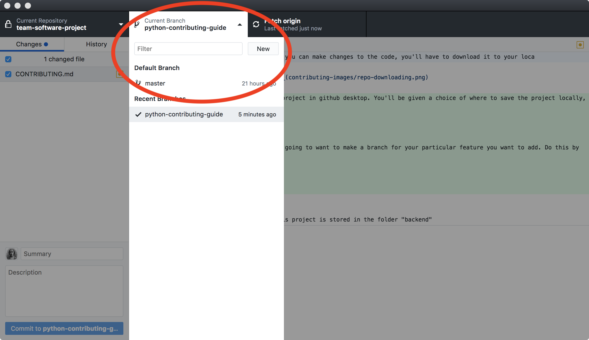
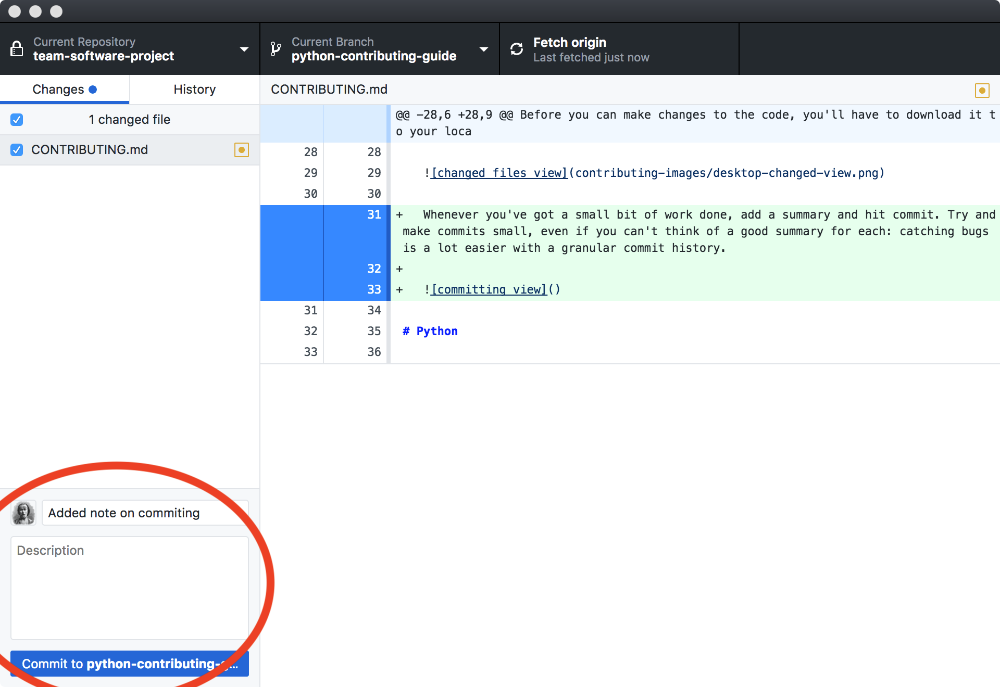
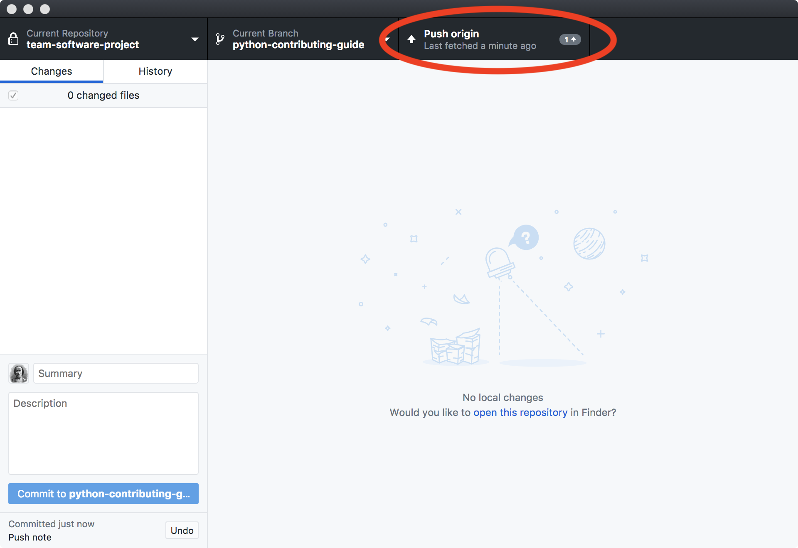

# Downloading the project and making changes

Before you can make changes to the code, you'll have to download it to your local machine so you can open it up in your editor. If you're already familiar with git and github, all you need to know is: don't make commits to master. Make a branch, commit on there, and make a pull request back to master. If you're not familiar, here's a short guide:

1. Download and install [github desktop](https://desktop.github.com).

   In theory, you can do all of this stuff from the command line, but it's a total headache and github desktop makes it much easier. There's also a lot of github-specific conventions that are difficult to remember (how does github handle rebasing? how exactly are commits squashed?). If you know what you're doing, feel free to ignore all the github-specific stuff, but "there be dragons" etc.
   
2. Download the repository.

   Go to [the main page for the repo](https://github.com/oisdk/team-software-project) and click the green button marked "clone or download", and then click "open in desktop" 

   

   This should open the project in github desktop. You'll be given a choice of where to save the project locally, and it'll download.

3. Make a branch.

   At this point, you're going to want to make a branch for your particular feature you want to add. Do this by opening github desktop, selecting the project, and clicking the "current branch" menu, and then "new":

   

   Name your branch after the feature you're adding.

4. Commit to the new branch.

   Now, whenever you make changes to the project, they'll show up in green in the main pane on the right. For instance, while writing this guide, this is what the window looks like:
   
   

   Whenever you've got a small bit of work done, add a summary and hit commit. Try and make commits small, even if you can't think of a good summary for each: catching bugs is a lot easier with a granular commit history.
   
   

5. Push to remote.

   Periodically, you can hit "push" in the top-right:
   
   
   
   This will sync your branch with the copy on github's servers.
   
6. Make a pull request.

   Back on the project's web page, you can select "compare and pull request".
   
   
   
   From here, you can add a short description of the pull request.
   
7. Code review and changes.

   Once you've made your pull request, you can still make changes to the branch it comes from. These will be added to the pull request.

8. Merge.

   Once you're happy that you've addressed everything in the code review, and all the checks have passed, you can merge your code into master.
   
9. Delete your branch.

   Don't forget to delete your branch after it was merged!

# Python

For contributing to the Python part of the project, you'll need to follow some conventions so that your code passes the continuous integration tests. These tests are run automatically on every pull request, and the results of them will show up in the code review view on github.

The Python part of the project is stored in the folder called backend: the subfolder also called backend stores the application code, and tests stores the tests.

If you want to add to an already existing file, you'll need to do 4 things to pass the continuous integration tests:

1. Pass the linter.

   pylint is run over any new additions, which will enforce standard python style across the project.
   
2. Pass any already-existing tests.

   If your code changes the behaviour of other code which has tests in the project, the previous tests will need to pass.

3. Add tests to pass the coverage level.

   If you're adding a significant amount of new code, you may need to add tests to the code so that the coverage level doesn't drop too low. There are 2 ways to do this:
   
   1. Using doctest
   
      If your tests are simple and example-based, you can include them in the docstring for your new code and they'll automatically be run when testing. For example:
      
      ```python
      def double(x):
          """Returns the double of some number.
          
          >>> double(3)
          6
          
          >>> double(4)
          8
          """
          return x + x
      ```
      
      More information on doctest and the syntax for different kinds of tests is available at its [documentation page](https://docs.python.org/3.5/library/doctest.html).
      
   2. Using unittest
   
      Every module will have a corresponding test file in the tests folder. Test files are just the name of the module file prefixed with `test_`. In this file, you'll need to add a new testing method to test the functionality of your code. Information on how to do this is available at [unittest's documentation page](https://docs.python.org/3.5/library/unittest.html).
      
4. Add requirements to requirements.txt

   If your code imports a library that isn't in the standard library and wasn't already added as a requirement to the project, you'll need to add the name of that library to the requirements.txt file. Just the name of the library is fine, on a new line, with no other information.


New modules go in the backend folder inside the backend folder (in other words, `team-software-project/backend/backend/`). When adding a new module, you'll need to add a corresponding test file in the tests folder. There's a little bit of fiddliness to get this to work correctly, so here's an example. Say we want to create a module called "new". We create a file `new.py` in `team-software-project/backend/backend/`. It might look like this:


```python
"""This is a new module"""

def double(x):
    """Returns the double of some number.

    >>> double(3)
    6

    >>> double(4)
    8
    """
    return x + x
```


Notice that you need a docstring for the module, otherwise the linter will fail.

Now, in `team-software-project/backend/tests`, create a file `test_new.py`, with this basic template:

```python
import unittest
import doctest
import backend.new

class TestNew(unittest.TestCase):
    def test_double(self):
        self.assertEqual(backend.new.double(2), 4)

def load_tests(loader, tests, ignore):
    tests.addTests(doctest.DocTestSuite(backend.new))
    return tests

if __name__ == '__main__':
    unittest.main()
```

You can organize the tests however you want, with test cases and subtests and so on, but unfortunately the `load_tests` function is necessary to run the doctests in the new module. Notice also that in the line `tests.addTests(doctest.DocTestSuite(backend.new))` you pass the name of the new module. It's easy to accidentally pass the name of another module here, so be careful when copying and pasting the above template.

# Javascript

## Structure

The frontend for the app is divided into 4 folders:

1. Javascript files go in `frontend/app/`

2. HTML files go in `frontent/html/`

3. CSS files go in `frontend/css/`

4. Assets (images, etc) go in `frontend/assets`

   (the folder `frontend/assets` might not exist in the repository if no-one has put anything in it yet. This isn't a bug: github doesn't sync empty folders. If you need to add an asset, and the folder isn't there, just go ahead and create it, everything else should be handled for you.)
   
## Installing

To run the tests and serve a static version of the frontend locally, you'll need to install 2 things first:

1. [node.js](https://nodejs.org/en/)

2. [npm](https://www.npmjs.com)

The site won't be using either of these programs: they're just to allow for testing, linting, and transpiling.


Once they're both installed, cd into the frontend folder, and run:

```bash
npm install
```

This will install everything you need to test and run the site.

## Running Tests

To run the tests, run:

```bash
npm test
```

This will run the linter and the tests. You'll also get a coverage report.

## Compiling the site locally

To make a static version of the site, run:

```bash
npm start
```

Then you can open the file `frontend/dist/index.html` and you will see what the site should look like.

## Making Changes to the JavaScript

All JavaScript in this project is ES6. Sticking to one standard makes it easier to learn and lookup documentation, and since it's transpiled to an older version you don't have to worry about which browser supports what. Just follow some guide for ES6 and you should be good to go.

In this version there are some differences from other versions of JavaScript out there that you might have used ([this](http://es6-features.org/) page has a good summary), but here are a couple that were most important:

1. Imports and Exports

   In the skeleton template for this project, there are two files in the foldr `frontend/app/`. `frontend/app/random.js`:
   
   ```javascript
   export function getRandomNumber() {
       return 4;
   }
   ```
   
   and `frontend/app/index.js`:
   
   ```javascript
   import * as random from "./random";

   alert(random.getRandomNumber());
   ```

   The `random.js` file exports a single function: this is done by prefixing it with the `export` keyword. In the `index.js` file, we import everything (`*`), name it `random` (if we had named it, for instance `numbers`, the function call would be `numbers.getRandomNumber()`), and give the location of the file we're importing from. (**NB**: if you're importing from a library, the path will be `../node_modules/library_name`).
   
   Alternatively, we could have not named the import, and specified what function we wanted to import:
   
   ```javascript
   import { getRandomNumber } from "./random";
   
   alert(getRandomNumber());
   ```

2. Lets and constants

   If you create a variable that doesn't get mutated, you can use the `let` keyword (rather than `var`) to create it. This will make sure that you don't mutate it. For instance:
   
   ```javascript
   function addFourTo(n) {
     var result = n + 4;
     return result;
   }
   ```
   
   In this case, the `result` variable is never mutated, so you can instead use `let`:
   
   ```javascript
   function addFourTo(n) {
     let result = n + 4;
     return result;
   }
   ```
   
   Similarly, for constants and so on, you should use `const`.
   
