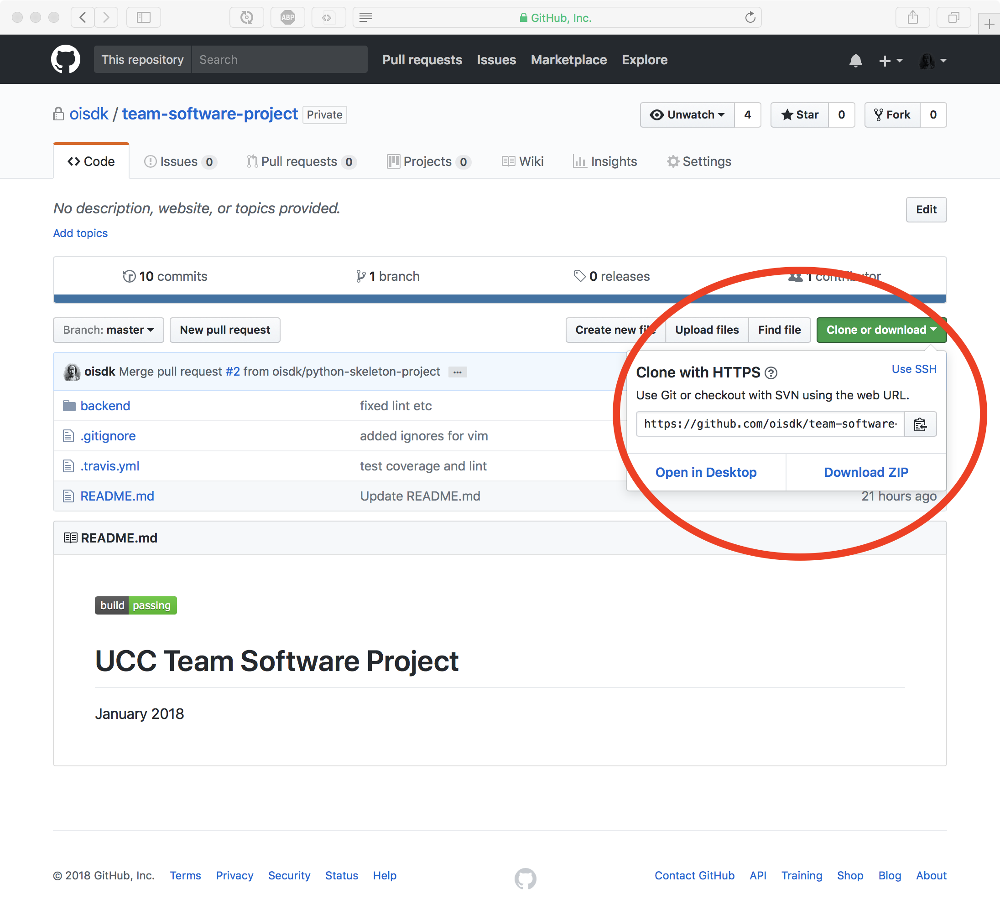

# Downloading the project and making changes

Before you can make changes to the code, you'll have to download it to your local machine so you can open it up in your editor. If you're already familiar with git and github, all you need to know is: don't make commits to master. Make a branch, commit on there, and make a pull request back to master. If you're not familiar, here's a short guide:

1. Download and install [github desktop](https://desktop.github.com).

   In theory, you can do all of this stuff from the command line, but it's a total headache and github desktop makes it much easier. There's also a lot of github-specific conventions that are difficult to remember (how does github handle rebasing? how exactly are commits squashed?). If you know what you're doing, feel free to ignore all the github-specific stuff, but "there be dragons" etc.
   
2. Download the repository.

   Go to [the main page for the repo](https://github.com/oisdk/team-software-project) and click the green button marked "clone or download", and then click "open in desktop" 

   

   This should open the project in github desktop. You'll be given a choice of where to save the project locally, and it'll download.

3. Make a branch.

   At this point, you're going to want to make a branch for your particular feature you want to add. Do this by opening github desktop, selecting the project, and clicking the "current branch" menu, and then "new":

   

   Name your branch after the feature you're adding.

4. Commit to the new branch.

   Now, whenever you make changes to the project, they'll show up in green in the main pane on the right. For instance, while writing this guide, this is what the window looks like:
   
   

   Whenever you've got a small bit of work done, add a summary and hit commit. Try and make commits small, even if you can't think of a good summary for each: catching bugs is a lot easier with a granular commit history.
   
   

5. Push to remote.

   Periodically, you can hit "push" in the top-right:
   
   
   
   This will sync your branch with the copy on github's servers.
   
6. Make a pull request.

   Back on the project's web page, you can select "compare and pull request".
   
   
   
   From here, you can add a short description of the pull request.
   
7. Code review and changes.

   Once you've made your pull request, you can still make changes to the branch it comes from. These will be added to the pull request.

8. Merge.

   Once you're happy that you've addressed everything in the code review, and all the checks have passed, you can merge your code into master.
   
9. Delete your branch.

   Don't forget to delete your branch after it was merged!

# Python

The Python portion of this project is stored in the folder "backend"

# Javascript

TODO
